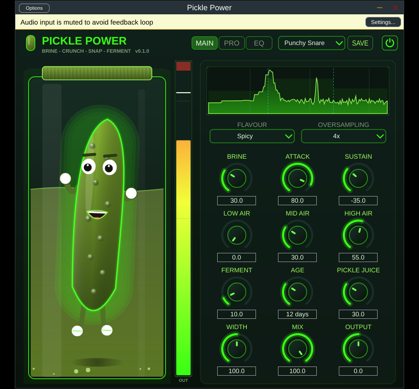
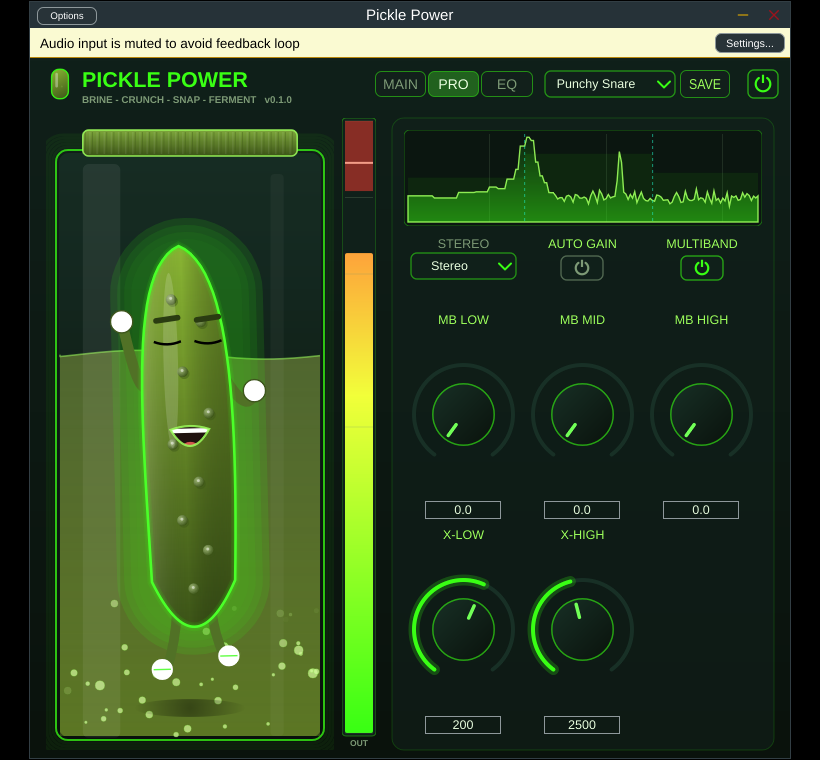
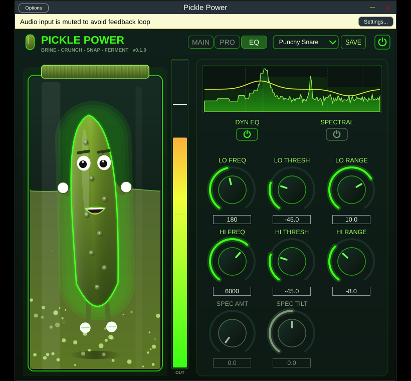

# Pickle Power 🥒⚡

A characterful **saturation · fermentation · dynamics** effect plugin built with
**JUCE 8** (C++20). Brine it, crunch it, snap it, ferment it — and watch the
neon pickle dance to your audio.

By **Tekk Engineering Audio Labs** — installs as `TEAL-Pickle-Power-VST` (VST3 / AU / Standalone).


&nbsp;**VST3 · AU · Standalone** &nbsp;·&nbsp; Windows / macOS / Linux &nbsp;·&nbsp; validated with **pluginval** (strictness 10)

<p align="center">
  
</p>
<p align="center">
  
  
</p>

---

## Install

Grab the latest installer for your platform from the
**[Releases page](https://github.com/Jtekkk/TEAL-Pickle-Power-VST/releases/latest)**:

| Platform | File | Installs |
|----------|------|----------|
| Windows  | `TEAL-Pickle-Power-VST-1.0.0-Windows.exe` | VST3 + Standalone |
| macOS    | `TEAL-Pickle-Power-VST-1.0.0-macOS.pkg`   | VST3 + AU + Standalone |
| Linux    | `TEAL-Pickle-Power-VST-Linux.tar.gz`      | VST3 + Standalone (see `packaging/linux/install.sh`) |

Then rescan plugins in your DAW. (macOS builds are unsigned — right-click → Open
the first time, or clear the quarantine flag.)

---

## What it does

Pickle Power is one box that takes a sound from *clean* to *gnarly* with
musical, loudness-matched stages. Every saturating stage is **loudness-matched**
(online RMS / K-weighted), so turning a knob changes the **character**, not just
the level.

### MAIN — the core chain

```
Input
  └─ Oversampling  (Off / 2× / 4× / 8×)
       ├─ Brine Saturation     (Dill · Kosher · Garlic · Spicy) — ADAA anti-aliased
       ├─ Crunch Designer      (transient shaper, −100 … +100)
       ├─ Snap Exciter         (three-band high-frequency "air")
       ├─ Fermentation Engine  (stateful — the sound matures as it runs)
       └─ Pickle Juice         (one-knob compress + saturate + auto-makeup)
  └─ Stereo Width  →  Mix  →  Output  →  True-Peak Limiter
Output
```

### PRO — bus & master tools

- **Mid / Side** processing for the whole nonlinear core
- **Multiband saturation** — 3 bands with adjustable Linkwitz-Riley crossovers,
  per-band drive and per-band loudness makeup; live per-band metering on the scope
- **Auto-Gain** — K-weighted (LUFS-style, ITU-R BS.1770) dry/wet loudness match

### EQ — surgical & spectral

- **Dynamic EQ** — two bands, Cytomic TPT state-variable bells with accurate boost
  *and* cut, drawn live on the analyzer
- **Spectral Saturation** — STFT overlap-add harmonic generation with a tilt control

### Visual feedback

A shared **spectrum analyzer** strip shows the live output spectrum, translucent
per-band level fills (multiband meters), dashed crossover markers, and the live
dynamic-EQ response curve. Inactive Pro sections dim their controls so the UI
always reflects what's engaged.

---

## Parameters

| Parameter      | Range            | Notes                                        |
|----------------|------------------|----------------------------------------------|
| Brine / Type   | 0 – 100 % · 4 flavours | Saturation drive + harmonic character  |
| Crunch         | −100 – +100 %    | − softens transients, + adds snap            |
| Snap (×3)      | 0 – 100 %        | Low / Mid / High air exciter                 |
| Fermentation   | 0 – 100 %        | Stateful nonlinear saturation                |
| Age            | 1 day – 10 years | Maturity: ramp time + aggression ceiling     |
| Pickle Juice   | 0 – 100 %        | One-knob glue + harmonics                     |
| Width / Mix / Output | 0–200 % · 0–100 % · ±24 dB | Stereo, dry/wet, trim         |
| Oversampling   | Off / 2× / 4× / 8× | Anti-aliasing for the nonlinear core       |
| Stereo Mode    | Stereo · Mid/Side | How the core treats stereo                  |
| Multiband (+3) | on · 0–100 % ×3  | Per-band drive + crossovers                  |
| Dynamic EQ (×2)| on · freq/thr/range | Two dynamic bells                         |
| Spectral       | on · amount · tilt | STFT harmonic saturation                   |
| Auto-Gain      | on               | K-weighted loudness match                    |

### The Fermentation engine 🧪

Rather than a memoryless `out = tanh(in)`, the engine keeps a slow leaky
integrator of the signal's energy — a *harmonic age*. The longer it's driven, the
more it fills and the more aggressive the saturation becomes; it relaxes again
when the input goes quiet. **Age** sets the ramp time and aggression ceiling. The
sound literally matures in the jar.

### Nuclear Pickle ☢️

Push Brine, Crunch, Snap, Fermentation **and** Pickle Juice to (near) maximum and
the pickle goes Nuclear — shades on, glowing, spinning.

---

## Presets

16 curated factory presets ship in the box, covering the whole plugin:

> Init · Fat Drums · Punchy Snare · **Drum Bus Glue** · Bass Brine · **Sub Tight** ·
> Vocal Glue · **De-Ess & Tame** · **Vocal Air** · Tape Warmth · Air Sheen ·
> **Wide & Warm** · **Master Polish** · **Spectral Shimmer** · Lo-Fi Crush · Nuclear Pickle

(bold presets showcase the Pro/EQ tier). Save your own from the **SAVE** button —
user presets are stored as state XML in your user app-data folder.

---

## DSP notes

Pickle Power's algorithms are documented and source-cited in
[`docs/AUDIO_DSP_RESEARCH.md`](docs/AUDIO_DSP_RESEARCH.md). Highlights:

- **Anti-derivative anti-aliasing (ADAA)** on the Brine waveshaper (per-flavour
  antiderivatives, midpoint fallback) — measurably lower aliasing than naïve
  shaping at the same rate.
- **True-peak limiter** with inter-sample (4× Catmull-Rom) peak detection and a
  −1 dBTP default ceiling.
- **Cytomic TPT SVF** dynamic-EQ bells (accurate boost *and* cut).
- **ITU-R BS.1770 K-weighting** for the auto-gain loudness match.
- **STFT overlap-add** spectral saturation with a COLA-correct window scale.
- Latency-compensated bypass and correct PDC reporting for oversampling +
  spectral + look-ahead.

The whole thing passes **[pluginval](https://github.com/Tracktion/pluginval)** at
**strictness level 10** (state restoration, automation, threading, every sample
rate & block size, fuzzing) on all three platforms — gated in CI on every push.

---

## Building from source

Requires CMake ≥ 3.22 and a C++20 compiler. JUCE is fetched automatically
(pinned tag), or point CMake at a local copy with `-DJUCE_DIR=...`.

```bash
cmake -B build -DCMAKE_BUILD_TYPE=Release        # add -DPP_BUILD_TESTS=ON for tests
cmake --build build --config Release
ctest --test-dir build -C Release                # DSP smoke + state/preset round-trip
```

### Linux build dependencies

```bash
sudo apt-get install libasound2-dev libx11-dev libxext-dev libxinerama-dev \
  libxrandr-dev libxcursor-dev libxcomposite-dev libfreetype6-dev \
  libfontconfig1-dev libgl1-mesa-dev
```

(VST3 + Standalone build on Linux; AU is macOS-only.) Build artifacts land under
`build/PicklePower_artefacts/`.

---

## Project layout

```
PicklePower/
├── CMakeLists.txt
├── .github/workflows/build.yml   # CI: 3-platform build, tests, pluginval, installers, release
├── docs/                         # DSP research report, screenshots
├── packaging/                    # Inno Setup (Win), pkgbuild (macOS), install.sh (Linux)
├── Tests/                        # DspSmokeTest, StateRoundTripTest
└── Source/
    ├── PluginProcessor.{h,cpp} · PluginEditor.{h,cpp}
    ├── DSP/    # Oversampler, BrineSaturator, CrunchDesigner, SnapExciter,
    │           # FermentationEngine, PickleJuice, MultibandSaturator,
    │           # DynamicEQ, SpectralSaturator, TruePeakLimiter, DSPHelpers
    ├── GUI/    # NeonLookAndFeel, DancingPickle, PickleJar, SpectrumAnalyzer, …
    └── Utils/  # Constants, Theme, PresetManager
```

## Licence

The plugin source here is yours to build on. **JUCE** is a separate dependency
under its own licence (GPLv3 or a commercial JUCE licence) — a commercial,
closed-source release requires an appropriate JUCE licence, and the splash screen
must stay enabled until you hold one.
